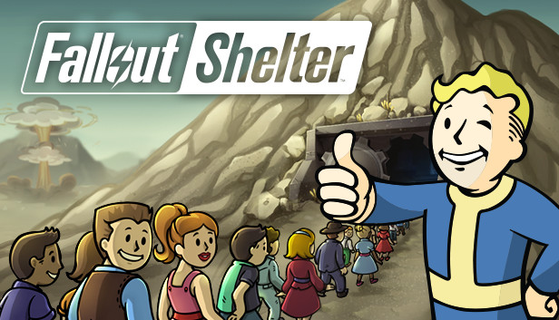
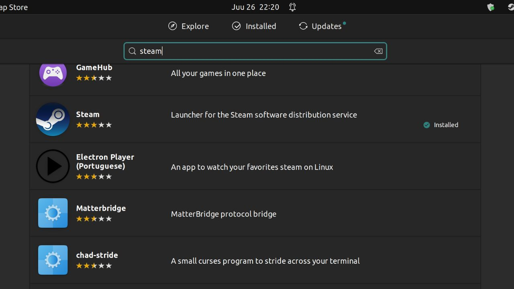
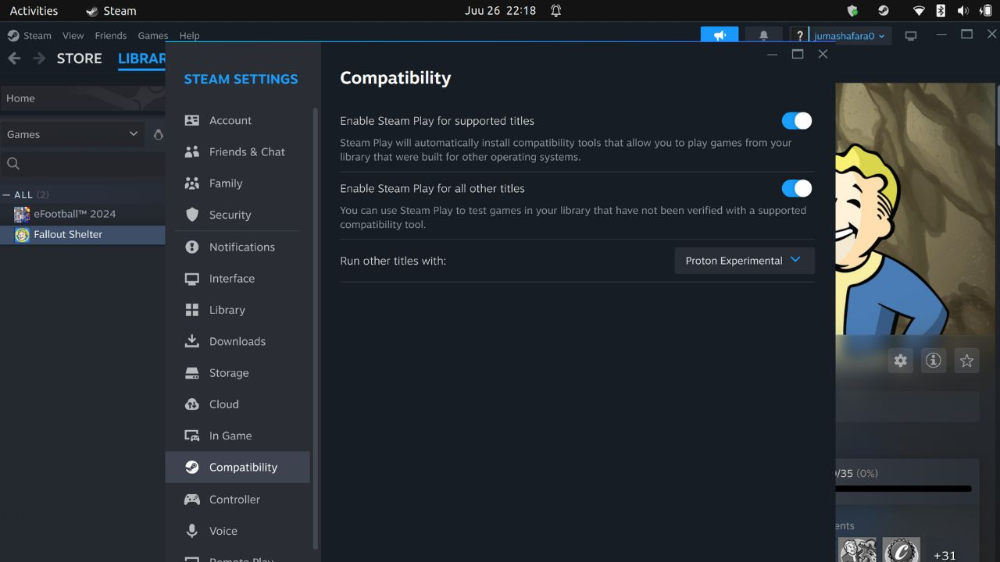
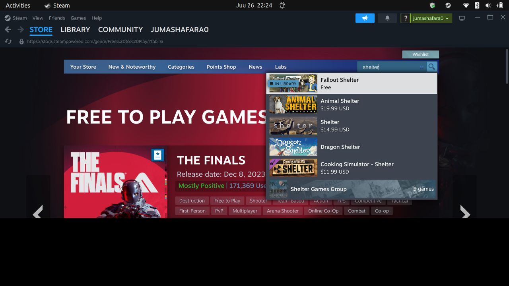
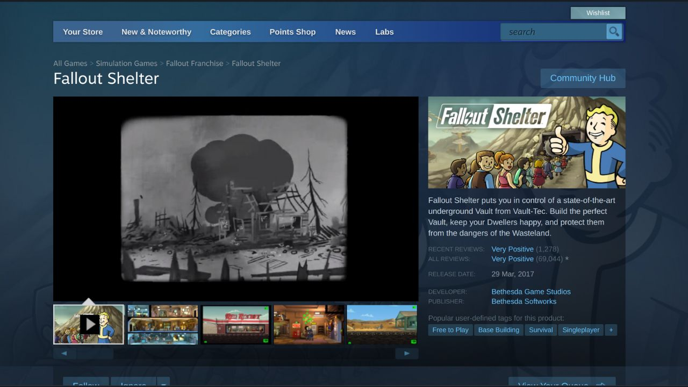

## Step 1. Install Steam.

Steam should be available to install using a package manager from all Linux distribution’s repositories, and in most cases using a software centre or with Terminal commands.

Once installation has finished, launch Steam using your application launcher, apply the update and then sign into your account.

Before we continue, we have a humble request. To be among the first to hear about future updates, simply enter your email below, follow us on <a href="https://x.com/dataideaorg"><i class="bi bi-twitter-x"></i>
 (formally Twitter)</a>, or subscribe to our <a href="https://www.youtube.com/@dataideaorg"><i class="bi bi-youtube"></i> YouTube channel</a>.

<iframe src="https://embeds.beehiiv.com/5fc7c425-9c7e-4e08-a514-ad6c22beee74?slim=true" data-test-id="beehiiv-embed" height="52" frameborder="0" scrolling="no" style="margin: 0; border-radius: 0px !important; background-color: transparent; width: 100%;" ></iframe>

## Step 2. Enable Steam Proton.

To enable Steam Proton for your library, navigate to Steam / Settings / Compatibility and tick both “Enable Steam Play for supported titles” and “Enable Steam Play for all other titles".

This will select Proton Experimental as the default Proton build, so restart Steam to apply.

## Install Fallout and start playing

From here, install each game in the usual manner, and launch once the installation process has finished.

### Search Fallout Shelter

## Download and start playing

At this stage, all the games should be playable including Fallout Shelter

<!-- Comments -->

<!-- inline_horizontal -->

<ins class="adsbygoogle"
     style="display:block"
     data-ad-client="ca-pub-8076040302380238"
     data-ad-slot="9021194372"
     data-ad-format="auto"
     data-full-width-responsive="true"></ins>

