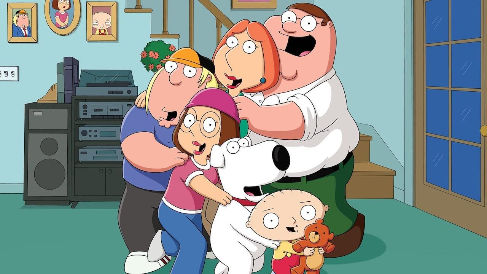

The animated comedy Family Guy has had a lasting effect on viewers with its signature brand of comedy. Creator Seth MacFarlane crafted a comedic format that's beloved by many. Premiering on Fox in 1999, the show struggled with ratings for three seasons, with its time slot frequently changed. Fox canceled Family Guy in 2002. However, the show found its audience through home video sales, Kazaa file sharing, and broadcasts on Adult Swim. Fox revived the series in 2005, and it remains strong, now in its 22nd season.

We’re celebrating the 20 best Family Guy episodes from Season 1 to Season 16, featuring the perfect mix of pop culture references, blue humor, and non-sequitur storytelling. Nearly all of these episodes prominently feature Brian and Stewie. Here are the episodes, listed in chronological order:

**"Da Boom"**

_Season 2, Episode 3_

Timing is key here. This episode originally aired on December 26, 1999, a prime position to goof on Y2K conspiracists. Peter takes his family into the basement to watch the clock strike midnight, and when it does, everyone's worst fears come true: planes fall from the sky, trains derail, and nuclear warheads launch. The rest of the episode is a dystopian dark comedy, where the Griffins search for other human life and try to rebuild society. "Da Boom" also features the first Giant Chicken Fight, a famous recurring gag.

**"Death is a Bitch"**

_Season 2, Episode 6_

Death comes for Peter's soul, but when Death sprains his ankle chasing Peter, Peter must take on Death's role. Adam Carolla regularly voices Death, but in this episode, Death's first appearance, he was voiced by Norm MacDonald, whose laid-back, sarcastic delivery was perfect.

<ins class="adsbygoogle"
     style="display:block; text-align:center;"
     data-ad-layout="in-article"
     data-ad-format="fluid"
     data-ad-client="ca-pub-8076040302380238"
     data-ad-slot="8693891310"></ins>

**"Road to Rhode Island"**

_Season 2, Episode 13_

The first "Road to…" episode, starring Brian and Stewie, was presented as special; instead of the regular piano introduction, the show began with still shots of Brian and Stewie on various adventures. This buddy comedy follows Brian and Stewie as they track down Brian's mother, delving deeper into the characters than before. This, along with the earlier Season 1 episode "Brian: Portrait of a Dog," proved the show could be more than just a random collection of cutaways.

**"Lethal Weapons"**

_Season 3, Episode 7_

This episode features two main intersecting plotlines: rude New Yorkers visiting Rhode Island to see the changing leaves and Lois taking martial arts lessons and learning to stand up for herself. The episode culminates in a critique of violence, resolved in typical Family Guy style with an all-out brawl.

**"To Love and Die in Dixie"**

_Season 3, Episode 12_

Chris witnesses a crime, and the family enters witness protection in the Deep South. Stewie starts a bluegrass band, Peter disrupts a Civil War reenactment, and Chris falls in love with a Southern girl named Sam (whom he initially mistakes for a boy). Chris and Sam's goodbye is sweet and touching.

<ins class="adsbygoogle"
     style="display:block; text-align:center;"
     data-ad-layout="in-article"
     data-ad-format="fluid"
     data-ad-client="ca-pub-8076040302380238"
     data-ad-slot="8693891310"></ins>

**"PTV"**

_Season 4, Episode 14_

When Family Guy returned after its cancellation, it took a few episodes to regain its footing. "PTV," a clever takedown of the FCC and its draconian prudery, marked the show's stride. It features one of the best Family Guy songs ever written—so good that Brian and Stewie performed a version of it at the 2007 Emmys.

**"Meet The Quagmires"**

_Season 5, Episode 18_

This time travel episode explores an alternate future where Peter misses his chance to marry Lois, and Quagmire marries her instead. In later seasons, the humanity in Peter and Lois' marriage dwindles, but this episode makes their love feel believable and real. The episode concludes with a tribute to Back To The Future and a Broadway-esque Rick Roll, courtesy of Brian.

**"Believe It or Not, Joe's Walking on Air"**

_Season 6, Episode 4_

Joe gets a new pair of legs, can walk again (just go with it), and becomes a complete douchebro as a result. The episode ends with Peter, Cleveland, Quagmire, and Bonnie trying to maim Joe because they liked him better when he was handicapped. A crass and mean-spirited episode overall, but funny enough to overlook its worst aspects.

<ins class="adsbygoogle"
     style="display:block; text-align:center;"
     data-ad-layout="in-article"
     data-ad-format="fluid"
     data-ad-client="ca-pub-8076040302380238"
     data-ad-slot="8693891310"></ins>

**"McStroke"**

_Season 6, Episode 8_

Sometimes, a Family Guy episode seems like a collection of random jokes rather than an actual plot. "McStroke" is one such episode, where Peter grows a mustache, has a stroke, and exposes a fast food corporation—all in a convoluted plot. The individual parts are so funny that the lack of cohesion matters less. Meanwhile, Stewie attends Chris and Meg's school as Zac Sawyer and quickly becomes the most popular boy in school.

**"Road to Germany"**

_Season 7, Episode 3_

A time travel episode, "Road to Germany" transports Brian, Stewie, and Mort Goldman to Warsaw, Poland in 1939, right before the Nazi occupation. Their efforts to return to the present day take them to both London and Berlin, where Stewie dresses as Hitler to steal some uranium. The "mirror gag," where Stewie Hitler meets the real Hitler, is an old vaudeville routine lifted from the Marx Brothers' classic film "Duck Soup."

**"Road to the Multiverse"**

_Season 8, Episode 1_

If there's a single episode to showcase as the best of the series—proof of the show's comedic value and creativity—"Road to the Multiverse" is a strong candidate. Stewie builds a contraption that allows him and Brian to travel to infinite alternate universes. The funniest is the Disney universe, where every character is reimagined as a Disney-style animation, complete with singing animals and a Disney-esque ballad titled "It's a Wonderful Day for Pie."

<ins class="adsbygoogle"
     style="display:block; text-align:center;"
     data-ad-layout="in-article"
     data-ad-format="fluid"
     data-ad-client="ca-pub-8076040302380238"
     data-ad-slot="8693891310"></ins>

**"And Then There Were Fewer"**

_Season 9, Episode 1_

In Agatha Christie's mystery novel "And Then There Were None," ten people are trapped on an island during a storm, and they begin dying one by one, realizing that one of them is the murderer. "And Then There Were Fewer" is Family Guy's tribute to the British 'locked room' mystery genre. It also leads to the permanent deaths of two main characters.

**"Brian Writes A Bestseller"**

_Season 9, Episode 7_

One of the best running jokes in the series is Brian's misadventures as a writer. He's terrible, and that forms the main plot of "Brian Writes A Bestseller." Brian sets out to write a terrible self-help book, and in a Producers-esque twist, it becomes a national bestseller. The success goes to his head, and he ends up humiliated by Bill Maher on Politically Incorrect. Stewie, who works as Brian's manager, is the perfect comic foil as Brian becomes a spoiled diva.

**"Road to the North Pole"**

_Season 9, Episode 7_

A bawdy Christmas special with a lot of heart, "Road to the North Pole" stars Brian and Stewie. They find Santa close to death due to exhaustion and excessive demands and decide to deliver the presents in his stead. The attempt is, of course, an unmitigated disaster and features some of the darkest comedy in the show's history. However, the episode manages to convey a heartfelt message against greed and materialism.

<ins class="adsbygoogle"
     style="display:block; text-align:center;"
     data-ad-layout="in-article"
     data-ad-format="fluid"
     data-ad-client="ca-pub-8076040302380238"
     data-ad-slot="8693891310"></ins>

**"Back to the Pilot"**

_Season 10, Episode 5_

Family Guy excels when it goes meta, and this episode, where Brian and Stewie travel back to the pilot episode of Season 1, serves as a self-analysis of the show's evolution. The episode plays on every time travel paradox and loophole, culminating in a sequence where hundreds of Stewies and Brians from multiple timelines debate about whether to change the past to alter the future.

**"Lois Comes Out Of Her Shell"**

_Season 11, Episode 6_

Lois has a midlife crisis, triggered by the worst imaginable birthday toast from Peter. Although Peter likes the new Lois, he eventually can't keep up. The episode ends with Peter beating up Justin Bieber and reasserting his love for Lois. The B-plot, where Stewie adopts a homicidal turtle, provides a zany complement.

**"Roads to Vegas"**

_Season 11, Episode 21_

The Star Trek: The Next Generation episode "Second Chances" deals with a transporter accident that creates two William Rikers. "Roads to Vegas" has an identical plotline; Stewie and Brian use a transporter to travel to Las Vegas, and the transporter creates a duplicate Brian and Stewie. Each set goes to Las Vegas unknowingly, and while one wins big, the other loses all its money and becomes indebted to a loan shark. Well-plotted, clever, and well-resolved, "Roads to Vegas" further proves that Brian and Stewie are the most fleshed-out, funniest characters on the show.

Don't miss out on any updates and developments! Subscribe to the DATAIDEA Newsletter it's easy and safe.

<iframe src="https://embeds.beehiiv.com/5fc7c425-9c7e-4e08-a514-ad6c22beee74?slim=true" data-test-id="beehiiv-embed" height="52" frameborder="0" scrolling="no" style="margin: 0; border-radius: 0px !important; background-color: transparent; width: 100%;" ></iframe>

**"Baking Bad"**

_Season 13, Episode 3_

Peter and Lois start a cookie shop that Peter, despite his best intentions, slowly transforms into a strip club. In the B-plot, Stewie gets addicted to cough syrup, and Brian holds an intervention with all of Stewie's stuffed animals. "Baking Bad" features Cookie Monster, who bookends the episode with
