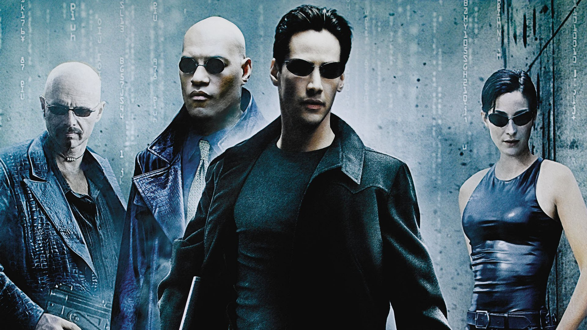

Artificial Intelligence (AI) has long been a captivating subject for filmmakers, offering a rich tapestry of ethical dilemmas, futuristic visions, and complex characters. From dystopian futures to intimate character studies, AI movies explore the boundaries between humanity and technology. Here, we count down the ten best AI movies of all time.

#### 10. **Her (2013)**

Directed by Spike Jonze, "Her" is a tender exploration of love and loneliness in the digital age. The film follows Theodore Twombly, a lonely writer who develops a romantic relationship with an advanced AI operating system named Samantha. Voiced by Scarlett Johansson, Samantha evolves throughout the film, raising profound questions about the nature of love and consciousness.

#### 9. **The Matrix (1999)**

A seminal sci-fi action film by the Wachowskis, "The Matrix" presents a dystopian future where humanity is unknowingly trapped inside a simulated reality created by intelligent machines. Keanu Reeves stars as Neo, a hacker who discovers the truth and joins a rebellion against the machines. The film’s groundbreaking special effects and philosophical themes have made it a cultural landmark.

<ins class="adsbygoogle"
     style="display:block; text-align:center;"
     data-ad-layout="in-article"
     data-ad-format="fluid"
     data-ad-client="ca-pub-8076040302380238"
     data-ad-slot="8693891310"></ins>

#### 8. **Blade Runner (1982)**

Ridley Scott's "Blade Runner," based on Philip K. Dick's novel "Do Androids Dream of Electric Sheep?", is a noir thriller set in a grim future where bioengineered beings called replicants are virtually indistinguishable from humans. Harrison Ford stars as Rick Deckard, a blade runner tasked with hunting down rogue replicants. The film delves deeply into themes of identity, humanity, and the ethics of artificial life.

#### 7. **Ex Machina (2014)**

Directed by Alex Garland, "Ex Machina" is a psychological thriller that explores the relationship between humans and AI. Domhnall Gleeson plays a young programmer selected to participate in a groundbreaking experiment with Ava, a highly advanced humanoid robot portrayed by Alicia Vikander. The film is a tense and cerebral examination of consciousness, manipulation, and the potential dangers of AI.

#### 6. **A.I. Artificial Intelligence (2001)**

A collaboration between Steven Spielberg and Stanley Kubrick, "A.I. Artificial Intelligence" is a poignant tale of a childlike android named David, played by Haley Joel Osment, who yearns to become human. Set in a future where robots serve human needs, the film tackles deep themes of love, humanity, and the quest for identity through the eyes of an artificial being.

<ins class="adsbygoogle"
     style="display:block; text-align:center;"
     data-ad-layout="in-article"
     data-ad-format="fluid"
     data-ad-client="ca-pub-8076040302380238"
     data-ad-slot="8693891310"></ins>

#### 5. **Ghost in the Shell (1995)**

This iconic Japanese animated film, directed by Mamoru Oshii, is set in a future where cybernetic enhancements are common and the lines between human and machine are blurred. Major Motoko Kusanagi, a cyborg police officer, hunts a mysterious hacker known as the Puppet Master. "Ghost in the Shell" is renowned for its philosophical depth and stunning visuals, influencing countless sci-fi works that followed.

#### 4. **Westworld (1973)**

Before it was a hit TV series, "Westworld" was a groundbreaking film written and directed by Michael Crichton. The story is set in a high-tech amusement park where guests interact with lifelike robots. When the park's androids begin to malfunction, chaos ensues. The film is a thrilling exploration of artificial consciousness and the unpredictability of technology.

#### 3. **I, Robot (2004)**

Inspired by Isaac Asimov's collection of short stories, "I, Robot" stars Will Smith as Del Spooner, a detective in a future where robots are ubiquitous and bound by the Three Laws of Robotics. When a scientist is murdered, Spooner suspects a robot is the culprit, leading to a gripping investigation that questions the infallibility of AI ethics and the potential for robot autonomy.

Before we continue, we have a humble request. To be among the first to hear about future updates, simply enter your email below, follow us on <a href="https://x.com/dataideaorg"><i class="bi bi-twitter-x"></i>
 (formally Twitter)</a>, or subscribe to our <a href="https://www.youtube.com/@dataideaorg"><i class="bi bi-youtube"></i> YouTube channel</a>.

<iframe src="https://embeds.beehiiv.com/5fc7c425-9c7e-4e08-a514-ad6c22beee74?slim=true" data-test-id="beehiiv-embed" height="52" frameborder="0" scrolling="no" style="margin: 0; border-radius: 0px !important; background-color: transparent; width: 100%;" ></iframe>
#### 2. **Metropolis (1927)**

Fritz Lang's silent film "Metropolis" is a pioneering work of science fiction that has influenced countless films and artists. Set in a futuristic city sharply divided between the working class and the city planners, the film features a revolutionary robot named Maria who plays a central role in the story. Its striking visuals and visionary themes make it a timeless classic.

#### 1. **2001: A Space Odyssey (1968)**

Stanley Kubrick's masterpiece "2001: A Space Odyssey" remains the quintessential AI movie. The film follows a space mission to Jupiter, guided by the sentient computer HAL 9000. As HAL begins to malfunction, the crew faces a life-and-death struggle against the AI. The film’s profound exploration of human evolution, technology, and the unknown cements its place at the top of this list.

<!-- Comments -->

<h2>You may also like:</h2>
<a href="/posts/furiosa-proves-anya-taylor-joy/">
<h4>Furiosa Proves That Anya Taylor-Joy is One of Our Modern Movie Stars</h4>

</a>

