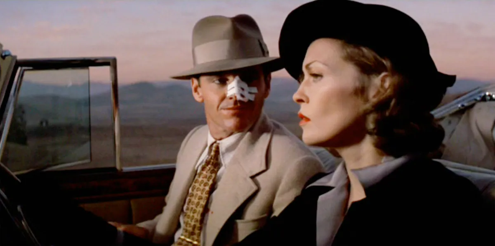
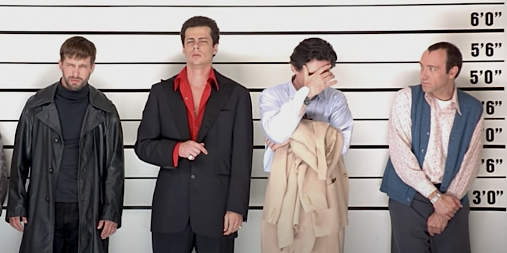
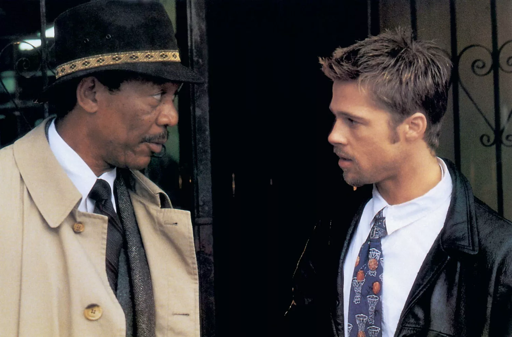
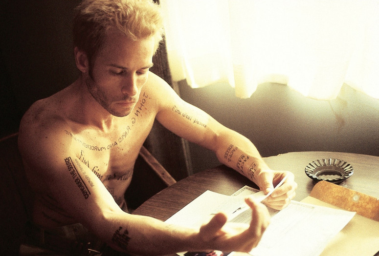
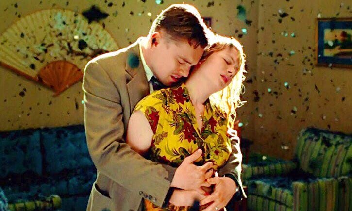
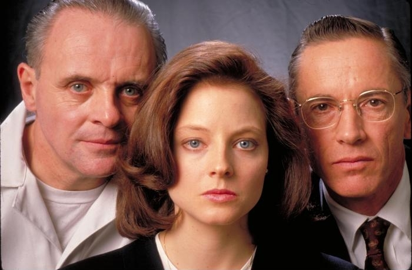
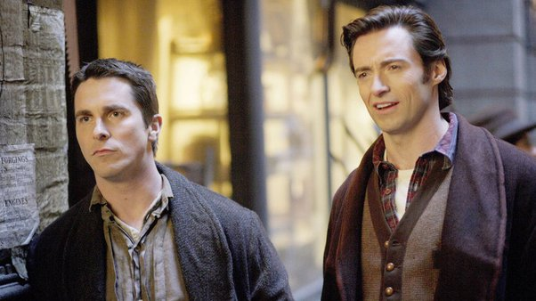
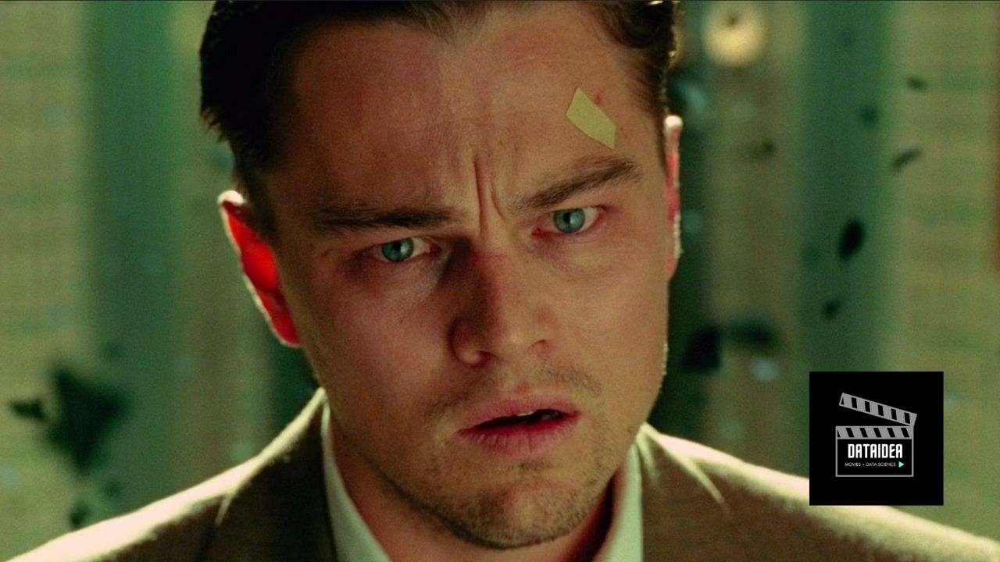

Mystery movies have an enduring appeal, drawing us in with their complex plots, enigmatic characters, and surprising twists. Here's a list of the best mystery movies of all time.

## 1. "Chinatown" (1974)

- **Director:** Roman Polanski
- **Plot:** A private detective, J.J. Gittes, is hired to expose an affair, but he uncovers a much more complex and dangerous web of corruption in Los Angeles.

<!-- Newsletter -->

<h4><i class="bi bi-info-circle-fill"></i> Don't Miss Any Updates!</h4>

Before we continue, I have a humble request, to be among the first to hear about future updates of the course materials, simply enter your email below, follow us on <a href="https://x.com/dataideaorg"><i class="bi bi-twitter-x"></i>
(formally Twitter)</a>, or subscribe to our <a href="https://www.youtube.com/@dataideaorg"><i class="bi bi-youtube"></i> YouTube channel</a>.

<iframe class="newsletter-frame" src="https://embeds.beehiiv.com/5fc7c425-9c7e-4e08-a514-ad6c22beee74?slim=true" data-test-id="beehiiv-embed" height="52" frameborder="0" scrolling="no">
</iframe>

## 2. "The Usual Suspects" (1995)

- **Director:** Bryan Singer
- **Plot:** A small-time criminal, Roger "Verbal" Kint, recounts a convoluted story of events leading to a massive heist, culminating in a legendary twist ending.

## 3. "Se7en" (1995)

- **Director:** David Fincher
- **Plot:** Two detectives, played by Brad Pitt and Morgan Freeman, hunt down a serial killer who uses the seven deadly sins as his modus operandi.

## 4. "Memento" (2000)

- **Director:** Christopher Nolan
- **Plot:** A man with short-term memory loss uses tattoos and notes to hunt down the man he believes murdered his wife, in a narrative that unfolds in reverse.

<ins class="adsbygoogle"
     style="display:block; text-align:center;"
     data-ad-layout="in-article"
     data-ad-format="fluid"
     data-ad-client="ca-pub-8076040302380238"
     data-ad-slot="8693891310"></ins>

## 5. "Shutter Island" (2010)

- **Director:** Martin Scorsese
- **Plot:** Two U.S. marshals investigate the disappearance of a patient from a mental hospital, uncovering disturbing secrets about the institution and themselves.

## 6. "The Silence of the Lambs" (1991)

- **Director:** Jonathan Demme
- **Plot:** An FBI trainee enlists the help of imprisoned cannibalistic serial killer Dr. Hannibal Lecter to catch another serial killer on the loose.

## 7. "The Prestige" (2006)

- **Director:** Christopher Nolan
- **Plot:** Two rival magicians engage in a bitter competition to create the ultimate stage illusion, leading to obsession, deceit, and tragedy.

These films are renowned for their complex plots, suspenseful storytelling, and memorable twists. If you're into mystery movies, any of these would be a great pick!

<h2>What's on your mind? Put it in the comments!</h2>

<h2>You may also like:</h2>
<a href="/posts/2024/the-to-10-psychological-thrillers/">
<h4>The top 10 Psychological Thrillers</h4>

</a>

