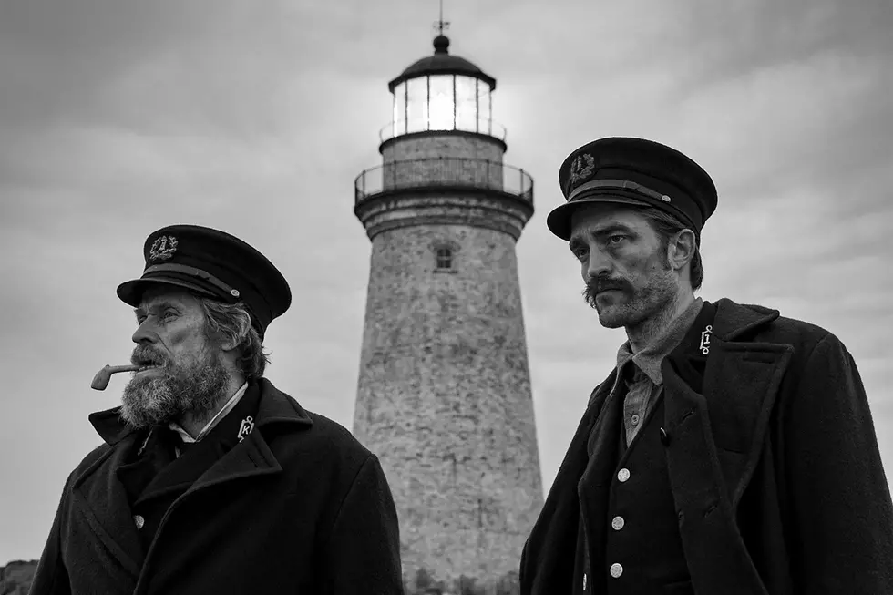
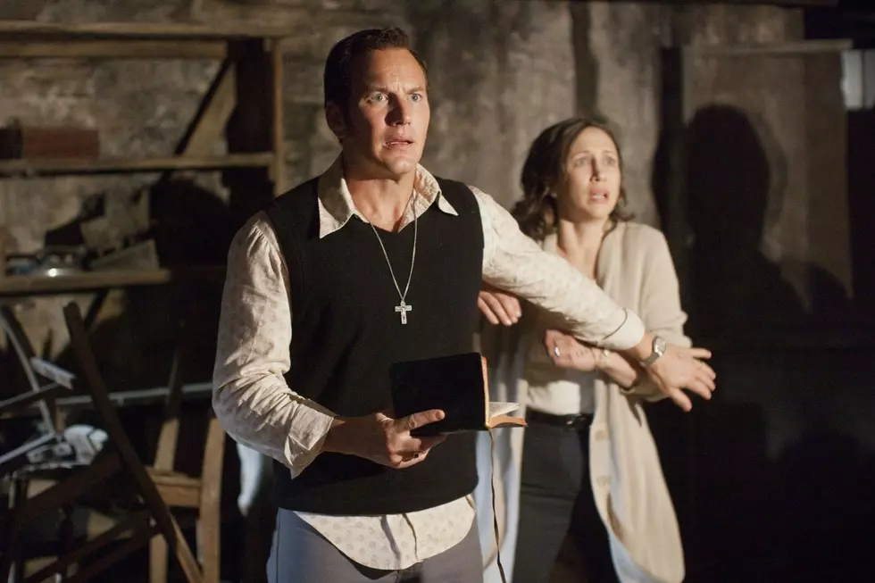
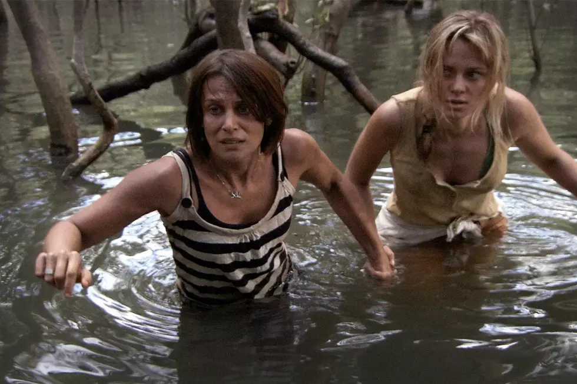
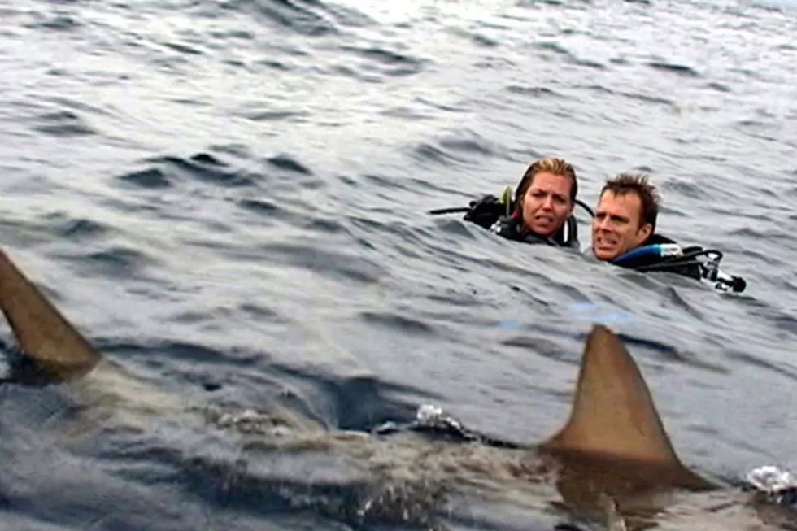

It always feels a little scarier knowing something like this really did happen.

## 1. The Lighthouse (2019)

The Lighthouse is so spooky and stylized that it feels like both a fairytale and a documentary from the late nineteenth century. Both of these notions are kind of true: the plot was partially inspired by Edgar Allan Poe’s unfinished story “The Light-House,” which he died before completing; and is also inspired by the Smalls Lighthouse Tragedy of 1801, during which two lighthouse keepers, who famously didn’t get along, were posted up at a remote Welsh lighthouse when one of them died by accident, and to keep from being arrested for murder the other built a coffin for the body and kept the lamp lit for the remainder of his shift. By the end, his friends didn’t recognize the survivor, and the British government changed the policy to make lighthouse keeper teams three people instead of two.

## 2. The Conjuring (2013)

If you’re a fan of The Conjuring franchise you probably already know that Ed and Lorraine Warren, the paranormal investigator couple played by Patrick Wilson and Vera Farmiga, were real people whose investigations and reports into supernatural hauntings have inspired a number of movies including The Amityville Horror. The Conjuring is based on the Warrens’ reports of the Perron family, who moved into a house in Rhode Island possessed by the spirit of a witch. Other cases in the Warrens’ archive have inspired the Annabelle movies, the Amityville franchise, and The Haunting in Connecticut — and all have been called into question by skeptics who believe the Warrens were charlatans.

<ins class="adsbygoogle"
     style="display:block; text-align:center;"
     data-ad-layout="in-article"
     data-ad-format="fluid"
     data-ad-client="ca-pub-8076040302380238"
     data-ad-slot="8693891310"></ins>

## 3. Black Water (2007)

If it’s not sharks, it’s crocodiles that come to menace anyone fool enough to venture to the wet parts of Australia. Black Water follows three unfortunate tourists in the mangrove swamp of Australia’s Northern Territory whose boat capsizes, leaving them stranded in a swamp and stalked relentlessly by a crocodile. It sounds a little far-fetched, but it really did happen to three people in 2003 whose trip to race quad bikes in the swamp took a nasty turn when a crocodile killed one of them and circled the other two while they hid in a tree, waiting for rescue.

## 4. The Exorcism of Emily Rose (2005)

The story behind The Exorcism of Emily Rose, like many on this list, is a genuine tragedy. The movie is a semi-high concept mix of classic exorcism horror and courtroom drama, telling the story of a priest who attempted an exorcism on a young girl who ultimately died, leaving him possibly liable for her death. The story was inspired by the real case behind the death of Anneliese Michel, a German woman who was subjected to 67 exorcism rites in the year before her death from malnutrition, and her parents and the priest who performed the rites were subsequently convicted of negligent homicide.

<strong>Subscribe to our Newsletter</strong>

To be among the first to hear about future updates, simply enter your email below, follow us on <a href="https://x.com/dataideaorg"><i class="bi bi-twitter-x"></i>
 (formally Twitter)</a>.

<iframe src="https://embeds.beehiiv.com/5fc7c425-9c7e-4e08-a514-ad6c22beee74?slim=true" data-test-id="beehiiv-embed" height="52" frameborder="0" scrolling="no" style="margin: 0; border-radius: 0px !important; background-color: transparent; width: 100%;" ></iframe>

## 5. Open Water (2003)

Shark attacks are rare, but given the number of movies that claim to be based on true stories of people getting chomped in the middle of the ocean, you’d think they happen all the time. Open Water is one of these movies that claims to be based on fact, and in some ways this is true. The movie was inspired by the true story of Tom and Eileen Lonergan, a pair of American vacationers whose scuba diving trip turned deadly when they were accidentally left behind in the middle of Australia’s Coral Sea after the boat crew failed to take an accurate headcount. Neither has been found but both are presumed dead — however, it’s unlikely that their ends were as gruesome as those suffered by the characters in Open Water.

<h2>You may also like:</h2>
<a href="/posts/2024/best-ai-movies/">
<h4>The Best 10 AI Movies of All Time</h4>

</a>

<ins class="adsbygoogle"
     style="display:block; text-align:center;"
     data-ad-layout="in-article"
     data-ad-format="fluid"
     data-ad-client="ca-pub-8076040302380238"
     data-ad-slot="8693891310"></ins>

