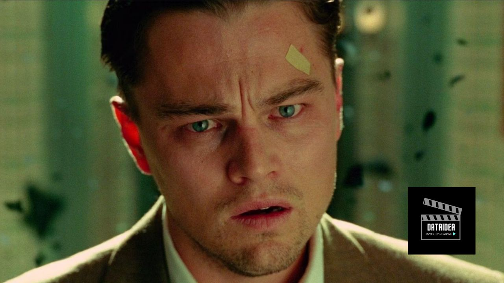

For those who crave movies that delve into the human psyche and leave you on the edge of your seat, psychological thrillers are the perfect genre. These films explore the darker aspects of the human mind, filled with suspense, twists, and unforgettable performances. Here are the top 10 psychological thrillers from the year 2000 onwards that have captivated audiences worldwide.

## 1. Shutter Island (2010)

Directed by Martin Scorsese

Martin Scorsese’s "Shutter Island" is a haunting exploration of madness and memory. Leonardo DiCaprio stars as Teddy Daniels, a U.S. Marshal investigating the disappearance of a patient from a mental institution on Shutter Island. As Teddy delves deeper into the case, he begins to question his own sanity. The film’s eerie atmosphere and mind-bending twists make it a standout in the genre.

<!-- Newsletter -->

<strong>Don't Miss Any Updates!</strong>

Before we continue, if you want to be among the first to hear about future updates, simply enter your email below, follow us on <a href="https://x.com/dataideaorg"><i class="bi bi-twitter-x"></i>
 (formally Twitter)</a>, or subscribe to our <a href="https://www.youtube.com/@dataideaorg"><i class="bi bi-youtube"></i> YouTube channel</a>.

<iframe src="https://embeds.beehiiv.com/5fc7c425-9c7e-4e08-a514-ad6c22beee74?slim=true" data-test-id="beehiiv-embed" height="52" frameborder="0" scrolling="no" style="margin: 0; border-radius: 0px !important; background-color: transparent; width: 100%;" ></iframe>

## 2. Memento (2000)

Directed by Christopher Nolan

Christopher Nolan’s "Memento" is a mind-bending thriller that tells the story of Leonard Shelby (Guy Pearce), a man with short-term memory loss who is trying to find his wife’s killer. The film’s unique narrative structure, which unfolds in reverse chronological order, keeps viewers engaged and constantly questioning what is real.

## 3. Gone Girl (2014)

Directed by David Fincher

David Fincher’s "Gone Girl" is a gripping tale of deception and manipulation. The film, based on Gillian Flynn’s bestselling novel, stars Rosamund Pike as Amy Dunne, who goes missing on her fifth wedding anniversary, and Ben Affleck as her husband Nick, who becomes the prime suspect. The film’s twists and turns, along with Pike’s chilling performance, make it an unforgettable thriller.

## 4. Black Swan (2010)

Directed by Darren Aronofsky

"Black Swan" is a psychological thriller that delves into the world of ballet, exploring themes of obsession and duality. Natalie Portman delivers an Oscar-winning performance as Nina, a ballerina who becomes consumed by her role in "Swan Lake." The film’s intense psychological drama and stunning visuals make it a must-watch.

## 5. The Girl with the Dragon Tattoo (2011)

Directed by David Fincher

David Fincher’s adaptation of Stieg Larsson’s novel is a dark and gripping thriller. Rooney Mara stars as Lisbeth Salander, a brilliant but troubled hacker who assists journalist Mikael Blomkvist (Daniel Craig) in solving a decades-old disappearance. The film’s complex characters and intense narrative make it a standout in the genre.

## 6. Prisoners (2013)

Directed by Denis Villeneuve

"Prisoners" is a tense thriller that follows the desperate search for two missing girls. Hugh Jackman stars as a father who takes matters into his own hands, while Jake Gyllenhaal plays the detective assigned to the case. The film’s moral ambiguity and relentless suspense make it a gripping watch.

## 7. The Machinist (2004)

Directed by Brad Anderson

Christian Bale delivers a haunting performance in "The Machinist," portraying Trevor Reznik, an industrial worker plagued by severe insomnia and paranoia. As Trevor's grip on reality loosens, the film unravels a disturbing tale of guilt and redemption. Bale's physical transformation and the film's unsettling atmosphere make it a psychological thriller to remember.

## 8. Oldboy (2003)

Directed by Park Chan-wook

"Oldboy" is a South Korean thriller that tells the story of Oh Dae-su (Choi Min-sik), a man who is imprisoned in a cell for 15 years without knowing why, and then released just as mysteriously. As he seeks revenge, he uncovers a web of conspiracy and betrayal. The film’s brutal action scenes and shocking plot twists have made it a cult favorite.

## 9. Enemy (2013)

Directed by Denis Villeneuve

Denis Villeneuve’s "Enemy" stars Jake Gyllenhaal in a dual role as a man who discovers his exact double. The film explores themes of identity and duality, with a narrative that blurs the lines between reality and paranoia. Its surreal and unsettling atmosphere leaves a lasting impression on viewers.

## 10. The Others (2001)

Directed by Alejandro Amenábar

"The Others" is a haunting psychological thriller that stars Nicole Kidman as Grace, a woman who lives with her two light-sensitive children in a secluded mansion. As they begin to experience strange occurrences, Grace must confront the chilling truth about their situation. The film’s eerie mood and unexpected twists make it a standout in the genre.

These films represent the best psychological thrillers of the 21st century, each offering a unique blend of suspense, intrigue, and psychological depth. Whether you’re a seasoned fan or new to the genre, these movies are sure to leave a lasting impression.

<h2>You may also like:</h2>
<a href="/posts/2024/best-ai-movies/">
<h4>The Best 10 AI Movies of All Time</h4>

</a>

<ins class="adsbygoogle"
     style="display:block; text-align:center;"
     data-ad-layout="in-article"
     data-ad-format="fluid"
     data-ad-client="ca-pub-8076040302380238"
     data-ad-slot="8693891310"></ins>

