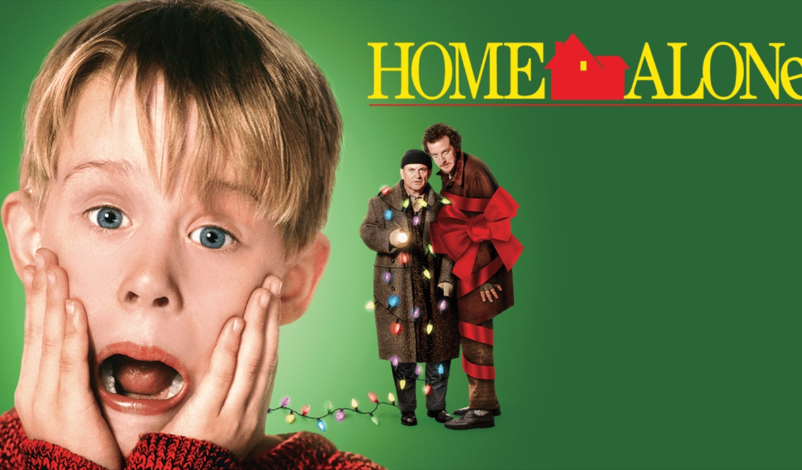
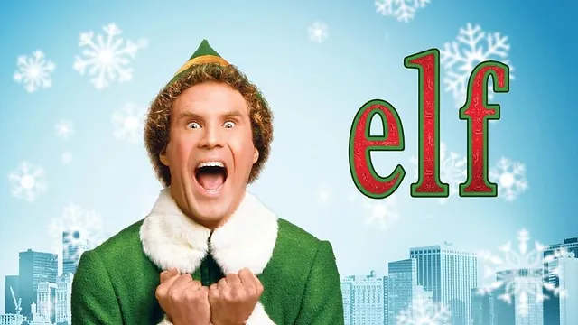
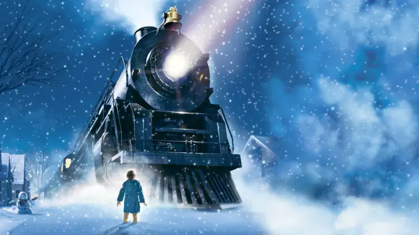
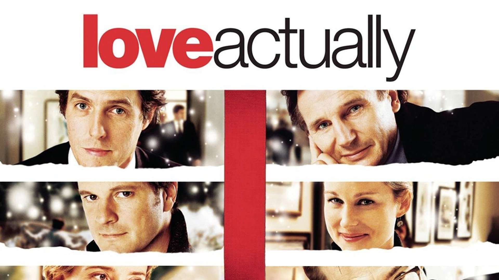

The past few decades have given us incredible Christmas films, from heartwarming tales to side-splitting comedies. Here’s our list of the five best Christmas movies of all time, each offering its own twist on holiday cheer. Get ready to laugh, cry, and feel the holiday spirit!

---

## 1. **The Nightmare Before Christmas** (1993)

**Why it’s the best:** Tim Burton’s imaginative twist on holiday films tells the story of Jack Skellington, the Pumpkin King of Halloween Town, who stumbles upon Christmas Town and becomes fascinated by the holiday. This stop-motion animated classic stands out for its unique blend of Halloween and Christmas, its hauntingly beautiful visuals, and a memorable soundtrack by Danny Elfman. _The Nightmare Before Christmas_ has become a beloved film for both Halloween and Christmas fans alike.

**Must-watch moments:** Jack’s first encounter with Christmas Town, and his rendition of _“What’s This?”_ as he discovers the magic of Christmas.

---

## 2. **Home Alone** (1990)

**Why it’s the best:** This holiday classic directed by Chris Columbus has become a staple of Christmas movie marathons worldwide. It follows Kevin McCallister (Macaulay Culkin), a young boy who’s accidentally left behind when his family goes on vacation – only to face off against two bumbling burglars. _Home Alone_ combines slapstick comedy, clever writing, and heartfelt family moments, creating a feel-good, laugh-out-loud movie perfect for all ages.

**Must-watch moments:** Kevin’s genius traps, from paint cans to icy stairs, and his reunion with his family on Christmas morning.

---

## 3. **Elf** (2003)

**Why it’s the best:** Will Ferrell’s portrayal of Buddy the Elf, a human raised at the North Pole who ventures to New York City, has become iconic. Directed by Jon Favreau, _Elf_ tells the story of an optimistic (if somewhat clueless) Buddy as he navigates life outside Santa’s workshop and tries to reconnect with his father. Ferrell’s infectious energy, memorable quotes, and the film’s quirky humor have cemented it as a modern Christmas classic.

**Must-watch moments:** Buddy’s interactions with a fake mall Santa ("You sit on a throne of lies!"), and his unfiltered Christmas joy spreading across New York City.

<ins class="adsbygoogle"
     style="display:block; text-align:center;"
     data-ad-layout="in-article"
     data-ad-format="fluid"
     data-ad-client="ca-pub-8076040302380238"
     data-ad-slot="8693891310"></ins>

---

## 4. **The Polar Express** (2004)

**Why it’s the best:** Based on Chris Van Allsburg’s beloved children’s book, _The Polar Express_ is a visually stunning animated film about a young boy who takes a magical train ride to the North Pole. With Tom Hanks lending his voice to multiple characters, the film captures the wonder and excitement of Christmas through a child’s eyes. Directed by Robert Zemeckis, the movie emphasizes themes of belief, wonder, and the power of holiday magic.

**Must-watch moments:** The breathtaking train ride, the roller-coaster-like frozen lake scene, and the heartfelt message about belief at the North Pole.

---

## 5. **Love Actually** (2003)

**Why it’s the best:** _Love Actually_ weaves together multiple stories of love, friendship, and family, all set during the Christmas season. With an ensemble cast that includes Hugh Grant, Emma Thompson, and Alan Rickman, this British rom-com is both heartwarming and humorous. Richard Curtis’s film is filled with memorable moments that remind us of the joy, complications, and connections that make the holiday season so special.

**Must-watch moments:** The unforgettable airport reunion scenes, the hilarious school nativity play, and Hugh Grant’s dance as the Prime Minister.

---

## Honorable Mentions

If you’re looking for more holiday cheer, here are some other great post-1990 Christmas movies:

- _The Santa Clause_ (1994) – A unique story about a man who accidentally becomes Santa.
- _Jingle All the Way_ (1996) – A hilarious adventure starring Arnold Schwarzenegger, tackling the chaos of Christmas shopping.
- _Klaus_ (2019) – An animated tale that offers a fresh, beautifully crafted origin story of Santa Claus.

<ins class="adsbygoogle"
     style="display:block; text-align:center;"
     data-ad-layout="in-article"
     data-ad-format="fluid"
     data-ad-client="ca-pub-8076040302380238"
     data-ad-slot="8693891310"></ins>

<h2>You may also like:</h2>
<a href="/posts/2024/the-to-10-psychological-thrillers/">
<h4>The top 10 Psychological Thrillers</h4>
</a>

