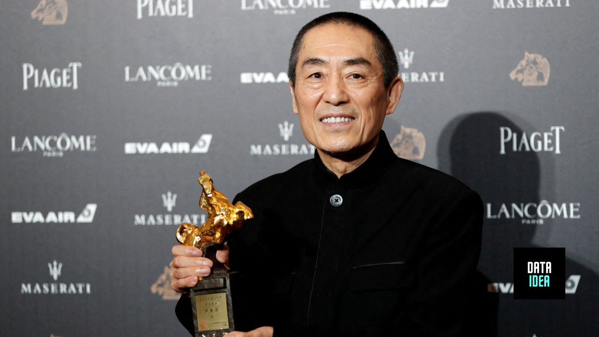

The celebrated auteur will tackle a Chinese-language feature adaptation of Liu Cixin's best-selling sci-fi book, which Netflix also brought to screen in its mega-budget series.

Liu Cixin’s best-selling sci-fi book, The Three-Body Problem, is heading home to China for another screen adaptation. Zhang Yimou, arguably China’s most revered living filmmaker, is set to direct a Chinese-language feature film based on the novel, it was revealed Sunday during a forum at the Shanghai International Film Festival.

<ins class="adsbygoogle"
     style="display:block; text-align:center;"
     data-ad-layout="in-article"
     data-ad-format="fluid"
     data-ad-client="ca-pub-8076040302380238"
     data-ad-slot="8693891310"></ins>

In Shanghai, Wang Changtian, chairman of leading local studio Beijing Enlight Media, said his company was in the early stages of developing the project, Chinese state news agency Xinhua reported. Three-Body Universe Cultural Development Co., a subsidiary of Yoozoo Pictures and the copyright holder for the book and related media, also confirmed the project was in the works.

News of Zhang’s involvement in a Chinese take on the beloved sci-fi saga lit up Chinese social media Monday. The Three-Body Problem, the first book in Cixin’s Remembrance of Earth’s Past trilogy, has spawned several adaptations across different media since its release in 2014 — with decidedly mixed success. A prior Chinese-language film adaptation of the book directed by Fanfan Zhang was never completed, but a Chinese TV adaptation by Tencent, titled Three-Body, did make it to the screen in 2023 and streamed on Peacock earlier this year.

<ins class="adsbygoogle"
     style="display:block; text-align:center;"
     data-ad-layout="in-article"
     data-ad-format="fluid"
     data-ad-client="ca-pub-8076040302380238"
     data-ad-slot="8693891310"></ins>

In the West, the best-known adaptation is Netflix’s big-budget take, restyled as 3 Body Problem, and helmed by Alexander Woo and Game of Thrones showrunners David Benioff and D.B. Weiss. The U.S. version has been considered a global hit, with Netflix renewing it for a second and third season that will complete the showrunners’ vision of the books’ full story. But in China, the reaction to the Netflix version has been decidedly mixed, with criticisms ranging from the show’s diverse, mostly non-Chinese key cast — a Chinese state media editorial attacked the adaptation as “American cultural hegemony” created under the guise of diversity — to some of the liberties that were taken with Liu Cixin’s beloved story. However, many in China — where Netflix is blocked and piracy is the only way to access the series — also undeniably liked the show, as plenty of social media chatter praised its scale and faithfulness to the spirit of the novels (a social media post from the state-run Global Times news outlet later accused foreign press of exaggerating the negative reactions to the show in order to stir up political tensions and portray Chinese viewers as unreasonably nationalistic). The Three-Body Problem media property has also been the subject of international intrigue for all the wrong reasons: In a shocking turn of events, a disgruntled employee of Three Body Universe in 2020 murdered Yoozoo’s founder and CEO, Lin Qi, who was credited with spearheading many of the book’s screen adaptations, including the Netflix version.

<ins class="adsbygoogle"
     style="display:block; text-align:center;"
     data-ad-layout="in-article"
     data-ad-format="fluid"
     data-ad-client="ca-pub-8076040302380238"
     data-ad-slot="8693891310"></ins>

Amid this complicated milieu around the various adaptations, no figure would be considered a safer pair of hands among Chinese fans than Zhang. A key figure of China’s Fifth Generation of filmmakers, he is beloved by film buffs at home and abroad for his films Raise the Red Lantern, Red Sorghum, To Live, Hero, and House of the Flying Daggers. He also directed the stunning opening and closing ceremonies of the 2008 Beijing Summer Olympics.

In recent years, however, his output has been directed squarely — and successfully — at the domestic Chinese moviegoer. In just the past year and a half, the 72-year-old director has released three films — little seen outside China — that have collectively earned $1.15 billion in his country. His recent period comedy thriller, Full River Red, produced by Huanxi Media, was China’s top-grossing movie of 2023 with a staggering box office haul of $634.6 million. He followed that up with Beijing Enlight Pictures’ crime drama Under the Light, also released in 2023, which earned $190 million. And he was back again near the start of 2024 with the Chinese Lunar New Year release of comedy-drama Article 20, produced again by Enlight and earning $323.6 million. One genre that Zhang had yet to tackle across his nearly 40-year career in cinema is futuristic sci-fi — and that will soon change.

Don't miss out on any updates and developments! Subscribe to the DATAIDEA Newsletter it's easy and safe.

<iframe src="https://embeds.beehiiv.com/5fc7c425-9c7e-4e08-a514-ad6c22beee74?slim=true" data-test-id="beehiiv-embed" height="52" frameborder="0" scrolling="no" style="margin: 0; border-radius: 0px !important; background-color: transparent; width: 100%;" ></iframe>

<h2>You may also like:</h2>
<a href="/posts/best-ai-movies/">
<h4>Best AI Movies of All Time</h4>

</a>

