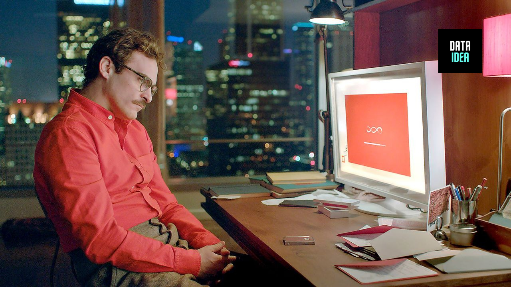

OpenAI is suspending its ChatGPT voice, Sky, after users claimed it resembled Scarlett Johansson’s voice from the 2013 film _Her_.

The company released a statement on X (formerly Twitter) today, announcing that it is "working to pause the use of Sky" to address the issue. Many users noted the voice's similarity to Johansson’s portrayal of an AI companion in the Spike Jonze-directed movie.

Sky is one of several ChatGPT voices available to users. OpenAI provided an explanation on its website about how these voices are selected and created.

“We support the creative community and worked closely with the voice acting industry to ensure we took the right steps to cast ChatGPT’s voices. Each actor receives compensation above top-of-market rates, and this will continue for as long as their voices are used in our products.”

The statement further clarified, “We believe that AI voices should not deliberately mimic a celebrity's distinctive voice—Sky’s voice is not an imitation of Scarlett Johansson but belongs to a different professional actress using her own natural speaking voice. To protect their privacy, we cannot share the names of our voice talents.”

<ins class="adsbygoogle"
     style="display:block; text-align:center;"
     data-ad-layout="in-article"
     data-ad-format="fluid"
     data-ad-client="ca-pub-8076040302380238"
     data-ad-slot="8693891310"></ins>

### Background on the Allegations

The controversy began last week when OpenAI revealed its new GPT-4o model during a livestream event, showcasing its ability to have realistic conversations about any topic. This functionality drew comparisons to _Her_, where Joaquin Phoenix’s character falls in love with an AI named Samantha, voiced by Johansson.

Adding to the speculation, OpenAI CEO Sam Altman posted the word "her" on X after the event. In a subsequent post, he likened the new voice and video mode to scenes from sci-fi movies. In a September interview with The San Francisco Standard, Altman even cited _Her_ as his favorite sci-fi film, praising its depiction of AI-human interactions as “incredibly prophetic.”

<ins class="adsbygoogle"
     style="display:block; text-align:center;"
     data-ad-layout="in-article"
     data-ad-format="fluid"
     data-ad-client="ca-pub-8076040302380238"
     data-ad-slot="8693891310"></ins>

### Moving Forward

It remains unclear how OpenAI will resolve the concerns about Sky mimicking Johansson’s voice or prevent similar issues in the future. For more information on artificial intelligence developments, check out the experimental AI-made video game that failed.

Juma Shafara contributor with DATAIDEA. Follow him on Twitter @juma_shafara.

<ins class="adsbygoogle"
     style="display:block; text-align:center;"
     data-ad-layout="in-article"
     data-ad-format="fluid"
     data-ad-client="ca-pub-8076040302380238"
     data-ad-slot="8693891310"></ins>

